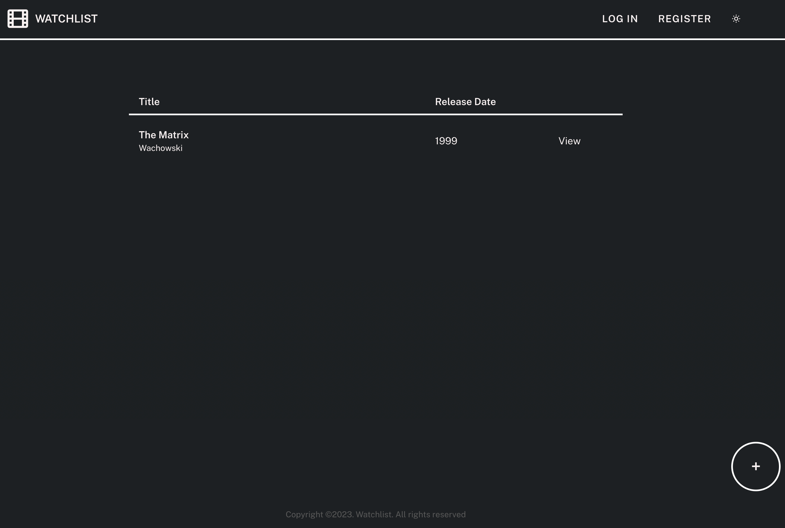

# watchlist
<div align="center">


</div>
This is my first full stack development project. The project was not deployed to a free server as this is a proof-of-concept. This ensures sufficient credits for the deployment of other web development tools ✌️. <br>

The website allows for users to log their favorite movies and videos in a watchlist
<br><br><br><br>

1. When clicking on 'view' in the movie list, users are redirected to a movie-specific html page displaying a thumbnail of an embedded video. The video clip is playable, allowing users to relieve their experience of the movie
<br><br>
2. When clicking on "Edit" in the movie page, users can update any of the movie's properties.
<br><br> 
3. MongoDB only stores the hashed password of the user at registration. Thereafter, only the hashed password inputs are compared against the database's password for better security.
4. The app also has a "dark" mode - just for fun!
<br><br> 

This project was built using flask, and flask_wtf.

## To start the website
```
pip install -r requirements.txt
```

<br>
Setup your MongoDB database instance and key in the connection string to the .env file - see ".env.example". 

Be sure to:
1. Name your database as 'watchlist'
2. Create a "titles" collection
3. Create a "users" collection to handle user login

<br>
To run the project locally:

```
flask run
```

OR

```
gunicorn: "movie_library.create_app()"
```